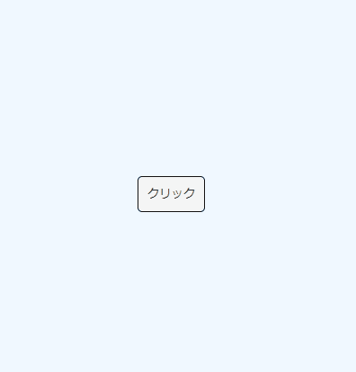

# Long Press Button



<div align="center">Github repository containing the source code for Long Press Button Component</div>

<p align="center">

<a href="https://twitter.com/pg_maaaashi" rel="nofollow">
  
</a>

# Table of Contents

- [Long Press Button](#long-press-button)
- [Table of Contents](#table-of-contents)
- [Usage](#usage)
  - [script src](#script-src)
  - [npm](#npm)

# Usage

```html
<!-- default -->
<long-press-button></long-press-button>
<!-- edit duration -->
<long-press-button duration=1000></long-press-button>
<!-- edit text -->
<long-press-button text="クリック" holding-text="Holding..."></long-press-button>

```

## script src

```html
<head>
  <script src="https://maaaashi.github.io/long-press-button/bundle.js"></script>
  <script>
  document.addEventListener('DOMContentLoaded', () => {
    const button = document.querySelector('long-press-button');
    button.onLongPress = () => alert('外部から渡された関数が実行されました！');
  });
</script>
</head>
<body>
  <long-press-button></long-press-button>
</body>
```

## npm

```
$ npm install @maaaashi/long-press-button
```

```jsx
import '@maaaashi/long-press-button'

const longPressButton = document.querySelector('long-press-button');
button.onLongPress = () => alert('外部から渡された関数が実行されました！');

<long-press-button></long-press-button>
```